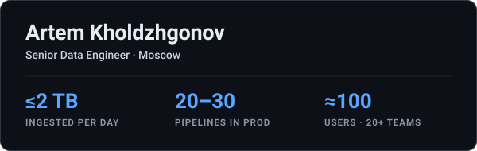

<picture>
  <source media="(prefers-color-scheme: dark)" srcset="assets/card-dark.svg">
  <source media="(prefers-color-scheme: light)" srcset="assets/card-light.svg">
  
</picture>

I take data from wherever it lives to wherever it can be analysed, and I measure the trip.
Five years across retail and banking.

### Selected work

**[csv_to_click](https://github.com/Odarink/csv_to_click)** — CSV into ClickHouse over an
HTTP-only path. 5.5 GB, 500M rows, 369.6 s.

- Profiling said per-row serialisation was 90% of insert time, not the network. Replacing it: 2.4×.
- Compression moved into the load workers, where zlib releases the GIL: 5.3× overall.
- Stopped there on arithmetic — producer 291 s and wire 368 s had converged, so nothing was left to win.
- 427 tests, green. Mutation testing and adversarial review caught the six defects they missed.

### Where I've worked

- **Wildberries** · Senior Data Engineer / Analyst · 2025 → now — ClickHouse, Kafka, S3, PySpark; market analytics and anomaly detection
- **Sber** · Data Engineer, Middle+ · 2023–2025 — consumer-credit risk marts on Greenplum and Hive/HDFS; data-quality tooling
- **Promsvyazbank** · Lead Database Analyst · 2022–2023 — RAW → STG → DDS → CDM on MS SQL; Power BI and a Flask service
- **LANIT** · Junior Data Engineer · 2021–2022 — Airflow ETL on PostgreSQL; API, FTP, HTTP and WFM sources

Rocket and impulse systems at BMSTU, then three years of self-taught Python — junior in 2021,
senior in 2025.

### Contact

[Telegram](https://t.me/Odarink) · [holdzhgonov.a@gmail.com](mailto:holdzhgonov.a@gmail.com) · English B2
