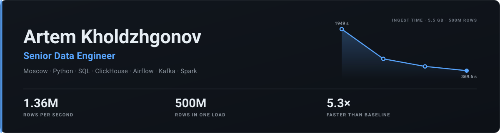

<picture>
  <source media="(prefers-color-scheme: dark)" srcset="assets/banner-dark.svg">
  <source media="(prefers-color-scheme: light)" srcset="assets/banner-light.svg">
  
</picture>

I move data from wherever it lives to wherever it can be analysed — and I measure the trip.
Five years across retail and banking: Wildberries, Sber, Promsvyazbank, LANIT.

---

## What I do

The whole lifecycle, not a slice of it: find the source (ClickHouse, Kafka, S3, flat files),
work out what the data actually means, model the warehouse, build the flow that keeps it fed,
then write the queries and dashboards people make decisions from.

Two things I care about more than most: **queries that stay readable** after they get fast,
and **knowing the number** — throughput, bytes on the wire, where the time went — before
touching anything.

**Core** &nbsp;

**Storage** &nbsp;

**Processing** &nbsp;

**Flow &amp; BI** &nbsp;

---

## Selected work — 500M rows in 369.6 s

[**csv_to_click**](https://github.com/Odarink/csv_to_click) loads arbitrary CSV files into
ClickHouse through an HTTP-only path behind a proxy: schema inference, a review step for types,
`ReplicatedMergeTree` + `Distributed` DDL, then a chunked load. One 5.5 GB file, 499,992,014 rows:

| Run | Time | vs. baseline |
| --- | ---: | ---: |
| Baseline | 1949 s | 1.00× |
| Serialisation reworked | 818 s | 2.38× |
| Compression in the producer | 530 s | 3.68× |
| Compression moved to workers | **369.6 s** | **5.30×** |

**1,358,911 rows/s.** Compression on the real payload: 6.08× (9.54 → 1.57 GB).

**I measured before I cut.** The first profile said the per-row serialisation loop was 90% of
insert time — not the network, which is where I would have guessed. Replacing it with one
vectorised call per chunk was worth 2.38× on its own, and nothing else on the list would have
mattered until it was gone.

**I stopped on arithmetic, not on fatigue.** In the final run the producer needed 291 s and the
wire needed 368 s. Those two converged, which means there is no imbalance left to exploit —
so the speed work is closed rather than polished. The environment's own capacity swings 2.38×
between afternoon and night on the same subnet, so every before/after claim above comes from
paired runs inside one hour.

**What I rejected, and what it cost to know.** Parallel producers: would drop the floor from
291 s to 168 s while the wire still needs 365 s — zero gain. TabSeparated over gzip: gzip has
already eaten the repeated JSON field names, so the saving is 20–25%, not 1.82×, and it buys a
new format with a silent-corruption risk and no reference output to diff against — bad trade.
zstd: rejected twice by the proxy in front of ClickHouse. More workers: five connections give
1.35× of one, so that knob is nearly dead here.

**On testing.** 427 tests, green in 6.4 s. They caught none of the six defects I introduced
during that work — mutation testing and adversarial multi-lens review caught all six. I run all
three now, and I trust the tests least.

*Currently:* the speed phase is done; I'm working through the silent data-corruption class —
precision loss, date overflow, and cleanup logic that can delete a table it shouldn't.

---

## Track record

| | Role | Period | What I worked on |
| --- | --- | --- | --- |
| **Wildberries** | Senior Data Engineer / Analyst | Mar 2025 – now | Full lifecycle for market analytics: sourcing from ClickHouse, Kafka, S3 and files; preprocessing in SQL, PySpark, Polars; ClickHouse and S3 storage design; Airflow and Kafka flows; query optimisation, BI dashboards, anomaly detection for several teams. |
| **Sber** | Data Engineer (Middle+) | Dec 2023 – Feb 2025 | Portfolio risk management for consumer lending. Analytical marts on Greenplum and Hive/HDFS, Spark/Hadoop/YARN, Airflow orchestration, and automated data-quality tooling. |
| **Promsvyazbank** | Lead Database Analyst, Customer Experience | Nov 2022 – Dec 2023 | Survey and CX data end to end: 3NF modelling, RAW → STG → DDS → CDM layering on MS SQL, incremental batch ETL, data quality, marts delivered as Power BI, Excel and a Flask web service. |
| **LANIT** (Goodt) | Junior Data Engineer | May 2021 – Nov 2022 | Airflow ETL on WSL and PostgreSQL for staff-performance statistics, bonus and rating calculation; sources over API, FTP, HTTP and WFM; index and query-plan tuning. |

Degree in rocket and impulse systems from BMSTU (2016–2022). I decided halfway through that I
wanted the school-age plan instead, taught myself Python for three years alongside the degree,
started as a junior data engineer in 2021, and reached senior in 2025.

---

## Contact

Moscow · Russian (native) · English B2 · email is the fastest way to reach me
